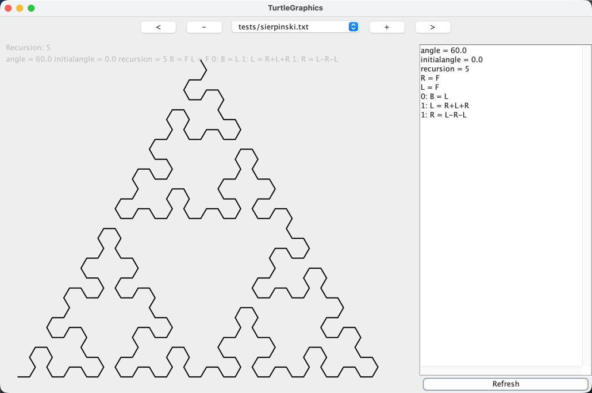

# RecursiveRoast - L-System Fractal Generator

[](https://github.com/dedee/recursiveroast/actions/workflows/build.yml)
[](https://github.com/dedee/recursiveroast/actions/workflows/release.yml)

(C)opyright D.Pfeifle 2010-2026



## What is RecursiveRoast?

RecursiveRoast is a Java application that generates and displays fractal graphics based on L-Systems. L-Systems are a type of formal grammar that can be used to model the development of plants, fractals, and other complex structures.

You can find more information about L-Systems on [Wikipedia](https://en.wikipedia.org/wiki/L-system).

## Quick Start

### Prerequisites

*   Java Development Kit (JDK) 17 or higher

### Running the Application

```bash
./gradlew run
```

The application will display a window with a graphical representation of an L-System. You can load different L-System files, adjust the recursion depth, and view the resulting fractals.

### Building

```bash
./gradlew build
```

📖 **For detailed build and release instructions**, see [BUILD_AND_RELEASE.md](BUILD_AND_RELEASE.md)

## L-System Syntax

The L-System rules are defined in text files with a simple syntax.

### Example

```
angle = 36
R = F
0 : BASE = R++R++R++R++R
1 : R = R++R++R|R-R++R
```

- **angle**: Defines the turning angle in degrees
- **Constants**: Define a constant as a sequence of commands (e.g., `R = F`)
- **Recursion level 0**: Defines the starting pattern (axiom)
- **Recursion level n**: Defines the replacement rules for each recursion level

### Commands

| Command | Description                               |
| :-----: | ----------------------------------------- |
|   `F`   | Draw a line forward                       |
|   `f`   | Move forward without drawing              |
|   `+`   | Turn right by the defined angle           |
|   `-`   | Turn left by the defined angle            |
|   `|`   | Turn 180 degrees                          |
|   `[`   | Push current position to stack            |
|   `]`   | Pop position from stack                   |

## Included L-System Examples

The project includes several pre-defined L-Systems in the resources:

- **Koch Snowflake** - Classic fractal curve
- **Sierpinski Triangle** - Triangular fractal pattern
- **Dragon Curve** - Space-filling curve
- **Gosper Curve** - Hexagonal space-filling curve
- **Fern** - Plant-like fractal structures
- And many more...

## Downloads

Pre-built releases are available on the [Releases page](https://github.com/dedee/recursiveroast/releases).

Download a JAR file and run it with:
```bash
java -jar recursiveroast-<version>.jar
```

## Documentation

- 📖 [BUILD_AND_RELEASE.md](BUILD_AND_RELEASE.md) - Detailed build, release, and version management instructions

## License

Copyright (C) D.Pfeifle 2010-2026

## Contributing

Contributions are welcome! Feel free to open issues or submit pull requests.

